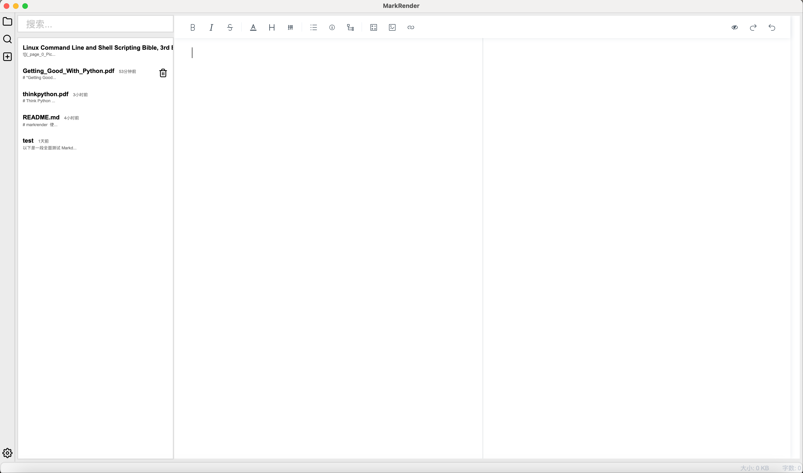
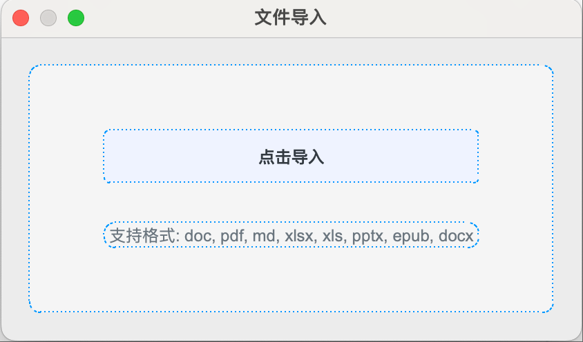
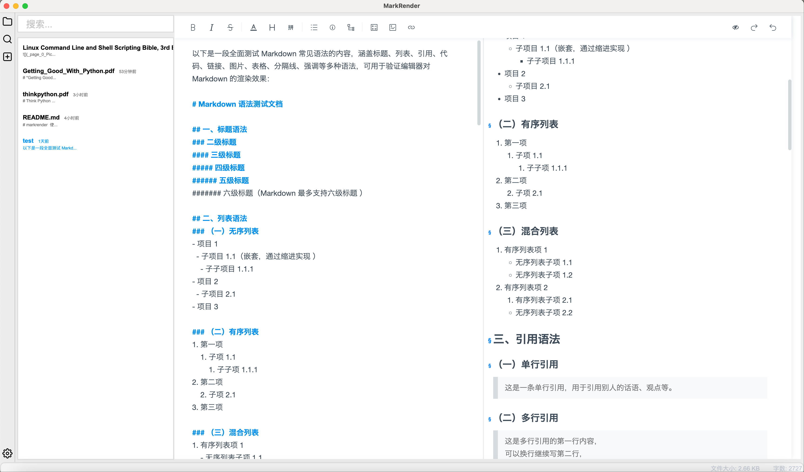

# MarkRender


> Convert any file into Markdown and export it as a readable file.

## Overview
MarkRender is a powerful file conversion tool that enables users to convert various file formats into Markdown and then export them as readable files. With a wide range of supported input and output formats, it provides a convenient solution for file format conversion.

## Key Features
- **Multiple Input Formats**: Support for converting PDF, DOCX, EPUB, XLSX, and more into Markdown.
- **Diverse Output Options**: Export converted content as Markdown, PDF, EPUB, etc.
- **Extensible Converters**: A variety of converters are available, and more are under development.

## Supported Input Files
1. PDF
2. DOCX
3. EPUB
4. XLSX

## Supported Output Files
1. Markdown
2. PDF
3. EPUB

## Supported Converters
- **markitdown**: Works well in most cases, but PDF file styles are not supported.
- **marker-pdf**: Converts PDF files into Markdown files.
- **xlsx2md**: Converts XLSX files into Markdown files.
- **epub2md**: Converts EPUB files into Markdown files.
- **docx2md**: Converts DOCX files into Markdown files.

## GUI Screenshots
Here are some screenshots of the application's graphical user interface:







## Installation
### Python Environment Setup
1. **Install Homebrew** (if not installed):
```bash
/bin/bash -c "$(curl -fsSL https://raw.githubusercontent.com/Homebrew/install/HEAD/install.sh)"
```

2. Install python

```
brew install python3
```

3. Create and activate a virtual environment (optional but recommended):

```
python3 -m venv venv
source venv/bin/activate
```

4. Install dependencies:
```
pip install -r requirements.txt
```

5. Run the application:

```
python3 main.py
```

## Build Mac DMG
### Using Makefile
1. Ensure that the Makefile and build.sh files are present in the project root directory.
2. Build the application using the following command:

```
make dmg
```
3. After the build is complete, you can find the generated DMG file in the appropriate output directory.

## TODO

- [ ] Build Linux AppImage
- [ ] fix model dir err

```
model dir not found at /Applications/markrender.app/Contents/Frameworks/magika/models/standard_v3_3
```
