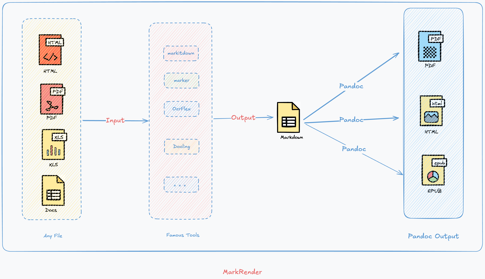

# MarkRender

> Convert any file into Markdown and export it as a readable file.

## Overview
MarkRender is a powerful file conversion tool that enables users to convert various file formats into Markdown and then export them as readable files. With a wide range of supported input and output formats, it provides a convenient solution for file format conversion.

## Key Features
- **Multiple Input Formats**: Support for converting PDF, DOCX, EPUB, XLSX, and more into Markdown.
- **Diverse Output Options**: Export converted content as Markdown, PDF, EPUB, etc.
- **Extensible Converters**: A variety of converters are available, and more are under development.

## Supported Input Files
1. PDF
2. DOCX
3. EPUB
4. XLSX

## Supported Output Files
1. Markdown
2. PDF
3. EPUB

## Supported Converters
- **markitdown**: Works well in most cases, but PDF file styles are not supported.
- **marker-pdf**: Converts PDF files into Markdown files.
- **xlsx2md**: Converts XLSX files into Markdown files.
- **epub2md**: Converts EPUB files into Markdown files.
- **docx2md**: Converts DOCX files into Markdown files.

More converters are in development.