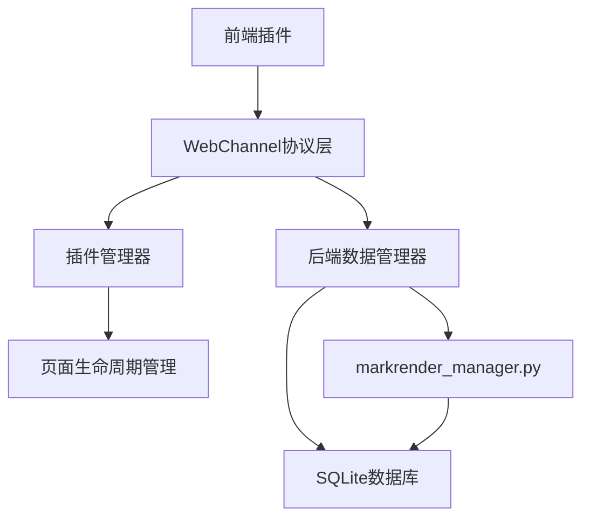

# MarkRender 插件化WebChannel通信协议标准

## 📋 目录
1. [协议概述](#协议概述)
2. [标准消息格式](#标准消息格式)
3. [数据操作接口](#数据操作接口)
4. [插件生命周期](#插件生命周期)
5. [错误处理规范](#错误处理规范)
6. [最佳实践](#最佳实践)

## 🎯 协议概述

### 核心原则
- **统一性**：所有插件使用相同的通信协议
- **标准化**：明确定义请求/响应格式
- **扩展性**：支持插件自定义操作
- **可靠性**：完善的错误处理和重试机制

### 通信架构


## 📝 标准消息格式

### 请求格式
```typescript
interface PluginRequest {
  requestId: string;           // 唯一请求ID
  action: string;              // 操作类型
  pluginId: string;            // 插件标识
  pageId: string;              // 页面实例ID (数据库主键)
  data: any;                   // 请求数据
  timestamp: string;           // 请求时间戳
  version: string;             // 协议版本
}
```

### 响应格式
```typescript
interface PluginResponse {
  requestId: string;           // 对应的请求ID
  success: boolean;            // 操作是否成功
  data?: any;                  // 响应数据
  error?: {                    // 错误信息
    code: string;
    message: string;
    details?: any;
  };
  timestamp: string;           // 响应时间戳
  version: string;             // 协议版本
}
```

## 🔄 数据操作接口

### 核心CRUD操作

#### 1. 读取数据 (READ)
```typescript
// 请求
{
  action: "read",
  pageId: "123",
  data: {
    fields?: string[];         // 指定字段
    includeHistory?: boolean;  // 是否包含历史记录
  }
}

// 响应
{
  success: true,
  data: {
    id: "123",
    title: "页面标题",
    content: "页面内容",
    page_type: "markdown",
    page_engine: "markdown",
    page_settings: "{}",
    created_at: "2025-08-29T08:00:00Z",
    updated_at: "2025-08-29T08:30:00Z",
    history?: ChangeHistory[]
  }
}
```

#### 2. 创建数据 (CREATE)
```typescript
// 请求
{
  action: "create",
  data: {
    title: string;
    content?: string;
    page_type: string;
    page_engine: string;
    page_settings?: string;
    tags?: string;
  }
}

// 响应
{
  success: true,
  data: {
    id: "124",           // 新创建的页面ID
    created_at: "2025-08-29T08:00:00Z"
  }
}
```

#### 3. 更新数据 (UPDATE)
```typescript
// 请求
{
  action: "update",
  pageId: "123",
  data: {
    title?: string;
    content?: string;
    page_settings?: string;
    tags?: string;
  }
}

// 响应
{
  success: true,
  data: {
    updated_at: "2025-08-29T08:30:00Z"
  }
}
```

#### 4. 删除数据 (DELETE)
```typescript
// 请求
{
  action: "delete",
  pageId: "123"
}

// 响应
{
  success: true
}
```

### 高级操作

#### 5. 批量操作 (BATCH)
```typescript
// 请求
{
  action: "batch",
  data: {
    operations: [
      {
        type: "update",
        pageId: "123",
        data: { title: "新标题" }
      },
      {
        type: "create",
        data: { title: "新页面", page_type: "markdown" }
      }
    ]
  }
}
```

#### 6. 搜索查询 (SEARCH)
```typescript
// 请求
{
  action: "search",
  data: {
    query: string;             // 搜索关键词
    page_type?: string;        // 过滤页面类型
    limit?: number;            // 结果数量限制
    offset?: number;           // 分页偏移
  }
}
```

#### 7. 导出数据 (EXPORT)
```typescript
// 请求
{
  action: "export",
  pageId: "123",
  data: {
    format: "pdf" | "markdown" | "html" | "json";
    options?: {
      includeSettings?: boolean;
      includeHistory?: boolean;
    }
  }
}
```

#### 8. 变更历史 (HISTORY)
```typescript
// 请求
{
  action: "history",
  pageId: "123",
  data: {
    limit?: number;
    since?: string;           // 时间戳
  }
}
```

## 🔄 插件生命周期

### 生命周期钩子
```typescript
interface PluginLifecycle {
  // 插件初始化
  onInit(): Promise<void>;
  
  // 页面加载完成
  onPageReady(pageId: string): Promise<void>;
  
  // 数据变更通知
  onDataChanged(pageId: string, changeType: string, data: any): Promise<void>;
  
  // 页面销毁前
  onBeforeDestroy(pageId: string): Promise<void>;
  
  // 插件卸载
  onDestroy(): Promise<void>;
}
```

### 系统事件
```typescript
// 自动保存事件
{
  action: "auto_save",
  pageId: "123",
  data: {
    content: string;
    trigger: "timer" | "user_action" | "focus_lost";
  }
}

// 页面切换事件
{
  action: "page_switch",
  data: {
    fromPageId: string;
    toPageId: string;
  }
}
```

## ❌ 错误处理规范

### 错误代码定义
```typescript
enum ErrorCode {
  // 通用错误
  UNKNOWN_ERROR = "E0001",
  INVALID_REQUEST = "E0002",
  UNAUTHORIZED = "E0003",
  
  // 数据错误
  DATA_NOT_FOUND = "E1001",
  DATA_CONFLICT = "E1002",
  DATA_VALIDATION_FAILED = "E1003",
  
  // 插件错误
  PLUGIN_NOT_FOUND = "E2001",
  PLUGIN_LOAD_FAILED = "E2002",
  PLUGIN_EXECUTION_ERROR = "E2003",
  
  // 系统错误
  DATABASE_ERROR = "E3001",
  NETWORK_ERROR = "E3002",
  FILE_SYSTEM_ERROR = "E3003"
}
```

### 错误响应示例
```typescript
{
  success: false,
  error: {
    code: "E1001",
    message: "数据未找到",
    details: {
      pageId: "123",
      operation: "read",
      suggestion: "请检查页面ID是否正确"
    }
  }
}
```

## 🔧 配置管理

### 插件配置
```typescript
// 请求插件配置
{
  action: "get_config",
  data: {
    scope: "plugin" | "user" | "system";
    key?: string;
  }
}

// 设置插件配置
{
  action: "set_config",
  data: {
    scope: "plugin" | "user" | "system";
    key: string;
    value: any;
  }
}
```

## 🚀 最佳实践

### 1. 错误处理
- 始终检查响应的`success`字段
- 提供用户友好的错误提示
- 实现重试机制处理临时性错误

### 2. 性能优化
- 使用批量操作减少请求次数
- 实现本地缓存机制
- 避免频繁的数据更新

### 3. 数据一致性
- 使用乐观锁处理并发更新
- 实现数据变更通知机制
- 定期同步本地缓存

### 4. 用户体验
- 实现加载状态提示
- 提供离线模式支持
- 实现自动保存功能

## 📊 示例实现

### 前端插件示例
```typescript
class MarkdownPlugin {
  private pageId: string;
  
  async init(pageId: string) {
    this.pageId = pageId;
    const data = await this.sendRequest('read', { pageId });
    this.renderContent(data.content);
  }
  
  async saveContent(content: string) {
    try {
      await this.sendRequest('update', {
        pageId: this.pageId,
        data: { content }
      });
      this.showSuccess('保存成功');
    } catch (error) {
      this.showError('保存失败', error);
    }
  }
  
  private async sendRequest(action: string, data: any): Promise<any> {
    return new Promise((resolve, reject) => {
      const request = {
        requestId: this.generateRequestId(),
        action,
        pluginId: 'markdown',
        pageId: this.pageId,
        data,
        timestamp: new Date().toISOString(),
        version: '1.0'
      };
      
      // 发送到后端
      window.pluginAPI.sendRequest(request, (response) => {
        if (response.success) {
          resolve(response.data);
        } else {
          reject(response.error);
        }
      });
    });
  }
}
```

### 后端处理器示例
```python
class PluginRequestHandler:
    def __init__(self, data_manager):
        self.data_manager = data_manager
    
    async def handle_request(self, request: dict) -> dict:
        try:
            action = request['action']
            page_id = request.get('pageId')
            data = request.get('data', {})
            
            if action == 'read':
                result = await self.data_manager.get_detail(page_id)
            elif action == 'update':
                result = await self.data_manager.save_markdown(
                    id=page_id, **data
                )
            elif action == 'create':
                result = await self.data_manager.save_markdown(**data)
            elif action == 'delete':
                result = await self.data_manager.delete_item(page_id)
            else:
                raise ValueError(f"未知操作: {action}")
            
            return {
                'success': True,
                'data': result,
                'timestamp': datetime.now().isoformat(),
                'version': '1.0'
            }
            
        except Exception as e:
            return {
                'success': False,
                'error': {
                    'code': 'E0001',
                    'message': str(e),
                    'details': {'action': action, 'pageId': page_id}
                },
                'timestamp': datetime.now().isoformat(),
                'version': '1.0'
            }
```

## 📖 版本历史

- v1.0 (2025-08-29): 初始版本，定义基础协议规范